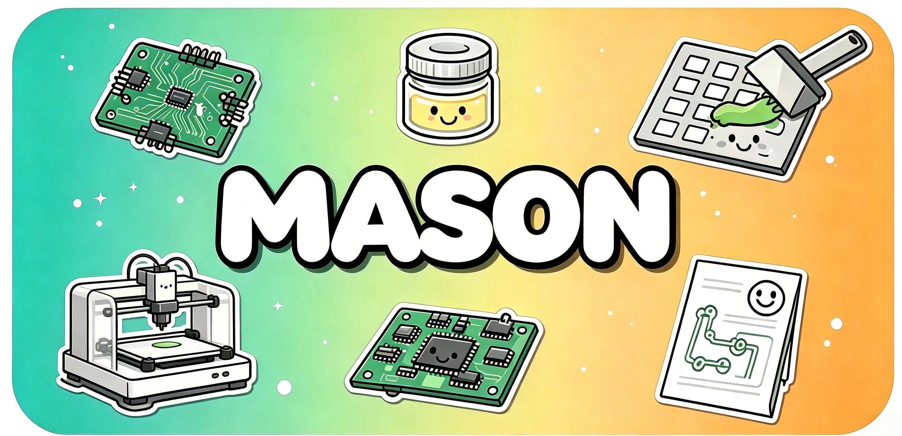

<div align="center">



#  Mason

**从 Gerber 到 3D 打印钢网 — 一键生成 PCB 锡膏印刷工具**
*Gerber 解析 · 参数化 CAD · 实时 3D 预览 · 零云依赖*

[English](README.en.md) · [📝 更新日志](https://github.com/NingZiXi/mason/releases) · [🐛 反馈问题](https://github.com/NingZiXi/mason/issues) · [👤 作者主页](https://github.com/NingZiXi)

[](https://github.com/NingZiXi/mason/actions/workflows/ci.yml) [](./LICENSE) [](https://tauri.app) [](https://vuejs.org) [](https://www.rust-lang.org) [](https://www.python.org) [](#快速开始)

### ⬇️ 下载安装包

[](https://github.com/NingZiXi/mason/releases/latest) [](https://github.com/NingZiXi/mason/releases/latest) [](https://github.com/NingZiXi/mason/releases/latest)

> 三个平台均提供预编译安装包，前往 [Releases](https://github.com/NingZiXi/mason/releases/latest) 下载对应版本。

</div>

---

## 📌 概述

Mason 是一款基于 Tauri 2 + Python (build123d) 的桌面应用，能将嘉立创 / JLCPCB 导出的 Gerber ZIP 文件直接转换为可 3D 打印的锡膏印刷工具。它提供两种工作模式，覆盖从原型验证到小批量生产的不同场景：

- **钢网夹具模式 (Jig)** — 生成底座 / 托盘 / 顶盖三件套，夹紧预制金属钢网进行印刷，适合异形 PCB 和需要均匀压紧的场景
- **PCB 钢网模式 (Stencil)** — 直接根据锡膏层 (Paste Mask) 生成自带 PCB 卡槽的一体式钢网，独立使用无需夹具，适合快速原型

核心设计目标是「拖入 Gerber → 导出 STL」的极简工作流，默认参数即可产出可用结果。

---

## ✨ 特性

### Gerber 解析
- 自动识别板框层 (`.GKO` / `Edge.Cuts` / `.GM1`) 与锡膏层 (`.GTP` / `.GBP`)
- 自研 RS-274X 解析器，支持 `%LM` 镜像、`%LR` 旋转、`%LS` 缩放等图层变换命令
- 支持 G02/G03 弧线、多行 D 码、异形板框轮廓提取
- 焊盘解析覆盖圆形 / 矩形 / 长圆形 / 圆角矩形 / 多边形 / 区域填充等光圈类型

### 钢网夹具模式
- 三件套参数化生成：底座 (B 面，含 M3 六角螺母沉孔)、PCB 托盘 (含免螺丝一体定位柱)、顶盖 (A 面)
- 螺丝布局：4 角恒有 + 沿周长按间距等距补位，支持 M2/M2.5/M3 等螺丝规格联动
- 夹具尺寸按钢网尺寸自动计算 (20mm 步进)，同尺寸 PCB 可复用底座与顶盖
- 异形 PCB 板框完整还原，卡槽间隙可调

### PCB 钢网模式
- 一体式钢网：PCB 外扩边框 + 顶面卡槽 (深度 = PCB 厚度) + 槽底薄钢网层
- 焊盘开孔仅贯穿钢网层，与板框坐标精确对齐
- 焊盘方形化 (obround → 直角矩形，匹配钢网厂工艺)
- 测试点过滤 (默认开启，匹配嘉立创钢网行为)
- 密脚错排、大孔开网格等后处理选项
- 外框形状可在「跟随板形」与「矩形」间切换，外框圆角可调
- 梯形取放缺口，便于从卡槽中取出 PCB

### 通用
- 实时 3D 预览 (three.js)，多部件后台预热，切换秒级响应
- 钢网渲染经深度优化，2400+ 焊盘约 3 秒完成
- 项目参数保存 / 加载 (JSON)
- 中英双语界面
- STL / STEP 双格式导出，自动创建时间戳目录

---

## 🛠️ 快速开始

### 环境要求

| 工具 | 版本 | 说明 |
| --- | --- | --- |
| Node.js | 20+ | 前端构建 |
| Rust | 1.77+ | Tauri 后端编译 |
| Python | 3.11+ | CAD 几何生成 (开发模式) |

### 开发模式运行

```bash
# 1. 安装 Python 依赖
pip install -r python/requirements.txt

# 2. 安装前端依赖并启动
npm install
npm run tauri:dev
```

开发模式下应用会自动探测系统 Python (PATH / 常见安装位置)；若未检测到或缺少依赖，可在「Python 环境」卡片中手动指定路径或一键安装。

### 打包发布 (内置 Python 引擎，用户零配置)

发布包内嵌完整的 Python + build123d/shapely/numpy 运行时，最终用户无需安装任何环境：

```bash
# 1. 构建内置 Python 运行时 (~500MB)
npm run build:python-env

# 2. 打包桌面应用
npm run tauri:build
```

安装包产物位于 `src-tauri/target/release/bundle/` (Windows: `.msi` / `.exe`)。

> **注意**：`resources` 必须使用数组语法 `["resources/python-env"]`，map 语法会摊平 `site-packages` 目录树导致依赖丢失。

---

## 📖 使用流程

### 钢网夹具模式

1. 拖入 Gerber ZIP，自动识别板框轮廓
2. 确认 PCB 尺寸 / 厚度、钢网尺寸等基础参数
3. (可选) 调整螺丝间距、托盘厚度、卡槽间隙等高级参数
4. 在右侧 3D 预览中切换 base / insert / cover 三个部件查看
5. 点击「导出」，选择目录，自动生成 `mason_export_<timestamp>/` 子目录并写入 STL 文件

### PCB 钢网模式

1. 切换到「PCB 钢网」模式
2. 拖入 Gerber ZIP (需包含 `.GTP` / `.GBP` 锡膏层)
3. 选择钢网层厚度预设 (树脂 0.15mm / 标准 0.2mm / FDM 0.3mm)
4. (可选) 调整焊盘缩小比例、边框宽、外框圆角、取放缺口等参数
5. 预览生成的钢网模型，确认焊盘开孔位置与数量
6. 导出 STL 直接 3D 打印，或发给钢网厂切割

---

## 🏗️ 技术架构

Mason 采用 **Tauri 2 (Rust) + Vue 3 + Python (build123d)** 的混合架构：

```
┌────────────────────┐   IPC    ┌─────────────┐   spawn   ┌──────────────────┐
│  Vue 3 前端        │ ───────▶ │  Rust 后端   │ ────────▶ │ Python CAD 引擎  │
│  three.js 3D 预览  │          │  参数 JSON   │           │ build123d+Shapely│
│  Pinia 参数状态    │ ◀─────── │  STL bytes   │ ◀──────── │ jig_generator.py │
└────────────────────┘          └─────────────┘           └──────────────────┘
```

- 前端将参数通过 Tauri IPC 发送给 Rust，Rust 写入 `input.json` 并调用 `python/jig_generator.py` 生成 STL
- Python 以常驻进程方式运行 (stdin/stdout 行 JSON 协议)，避免重复启动开销
- STL 按参数哈希缓存在前端，切换部件不重复计算；应用启动时后台预热各部件
- 千级焊盘钢网采用快速 STL 路径 (numpy 直接生成三角面 + OCC 平面网格化)，渲染性能提升至秒级

### 关键文件

| 路径 | 说明 |
| --- | --- |
| `python/jig_generator.py` | CAD 几何生成：`build_base` / `build_insert` / `build_cover` / `build_stencil` |
| `src/lib/gerber/parser.ts` | RS-274X 板框解析器 |
| `src/lib/gerber/pads.ts` | 锡膏层焊盘几何提取 |
| `src/stores/config.ts` | Pinia 全局配置状态 |
| `src/components/ModelPreview.vue` | three.js 3D 预览与 STL 缓存 |
| `src/components/StencilForm.vue` | 钢网模式参数面板 |
| `src/components/ConfigForm.vue` | 夹具模式参数面板 |
| `src-tauri/src/commands.rs` | Tauri IPC 命令 |
| `src-tauri/src/scad.rs` | Python 常驻进程管理 |

---

## 🧪 测试

项目包含前端单元测试与 Python 几何验证测试：

```bash
# 前端：Gerber 解析器单元测试
npm test

# 前端类型检查
npx vue-tsc --noEmit

# Rust 编译检查
cd src-tauri && cargo check

# Python 几何端到端验证 (build123d)
python python/tests/run_all.py
```

几何验证测试覆盖：螺丝布局一致性、三部件几何与孔位、异形板框、钢网焊盘开孔、取放缺口深度与方向、B 面六角螺母沉孔等 11 个测试脚本。

CI 通过 GitHub Actions 串联以上全部检查，每次 push / PR 自动运行。

---

## 📁 项目结构

```
mason/
├── .github/workflows/ci.yml          # CI: vitest + vue-tsc + cargo check + python tests
├── public/                           # 静态资源 (logo.svg)
├── scripts/build-python-env.ps1      # 内嵌 Python 运行时构建脚本
├── src/                              # Vue 3 前端
│   ├── components/                   # 业务组件 (ConfigForm / StencilForm / ModelPreview ...)
│   ├── composables/                  # useGerberOutline / useGerberStencil
│   ├── lib/gerber/                   # 自研 Gerber 解析器 + 单元测试
│   ├── i18n/                         # 中英双语文案
│   └── stores/                       # Pinia 状态管理
├── src-tauri/                        # Rust 后端 (Tauri)
│   └── src/{commands,scad,openscad_detect,error}.rs
├── python/
│   ├── jig_generator.py              # build123d CAD 生成 (base/insert/cover/stencil)
│   └── tests/                        # 几何端到端测试
├── test_gerber/                      # 示例 Gerber 文件
└── README.md
```

---

## ❓ 常见问题

**Q: 启动后显示「未检测到 Python」？**
A: 开发模式下应用会探测 PATH 和标准安装位置。若 Python 装在自定义路径，在「Python 环境」卡片手动指定 `python.exe`，需已安装 `build123d`、`shapely`、`numpy`。发布版自带内置引擎，无需此步骤。

**Q: Gerber ZIP 解析失败？**
A: 板框识别依赖 `.GKO` / `*Edge.Cuts*` / `.GM1` 文件；钢网模式还需要 `.GTP` 或 `.GBP` 的锡膏层。若文件命名特殊，可在导入组件中手动选择。

**Q: 钢网焊盘和 PCB 焊盘对不上？**
A: Mason 默认对长圆形焊盘做方形化处理 (匹配钢网厂工艺)，并按 PCB 板框居中对齐。若仍有偏差，检查 Gerber 坐标系是否与板框层一致。

**Q: 导出的文件在哪里？**
A: 导出时会在所选目录创建 `mason_export_<时间戳>/` 子文件夹，所有生成的 STL 文件放入其中，避免与现有文件混淆。

---

## 📄 许可证

[MIT](./LICENSE)

---

## 🙏 致谢

- [build123d](https://github.com/gumyr/build123d) — Python 参数化 CAD 内核
- [Tauri](https://tauri.app/) — 桌面应用框架
- [Vue 3](https://vuejs.org/) / [Pinia](https://pinia.vuejs.org/) / [Element Plus](https://element-plus.org/) / [three.js](https://threejs.org/)
- [Shapely](https://github.com/shapely/shapely) — 2D 几何运算

---

<div align="center">

如果觉得项目对您有帮助，请给个 ⭐ Star 支持一下！这对我非常重要 🙏

[](https://github.com/NingZiXi/mason/stargazers)

</div>
